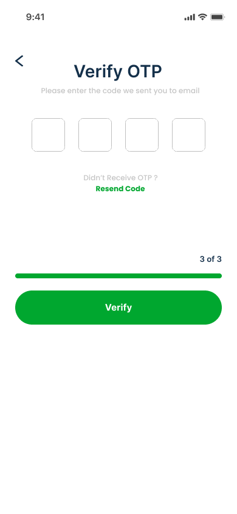
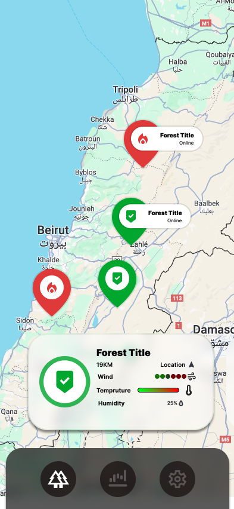
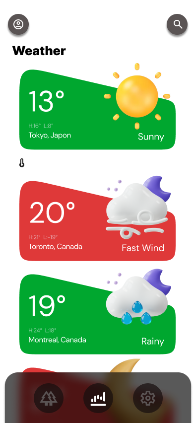
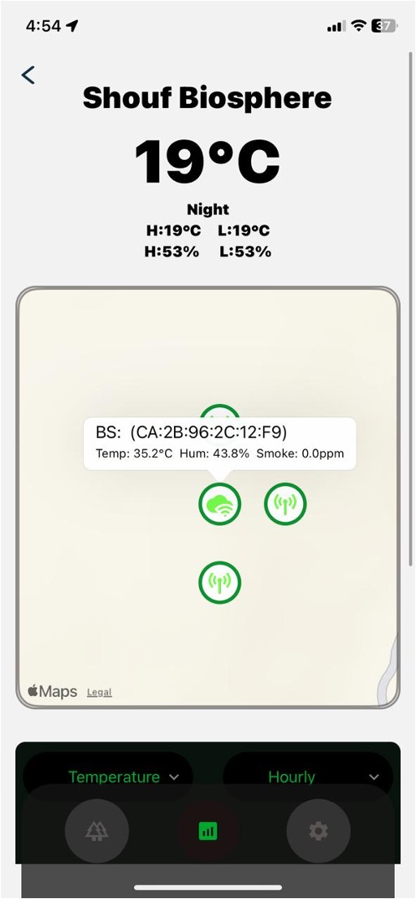
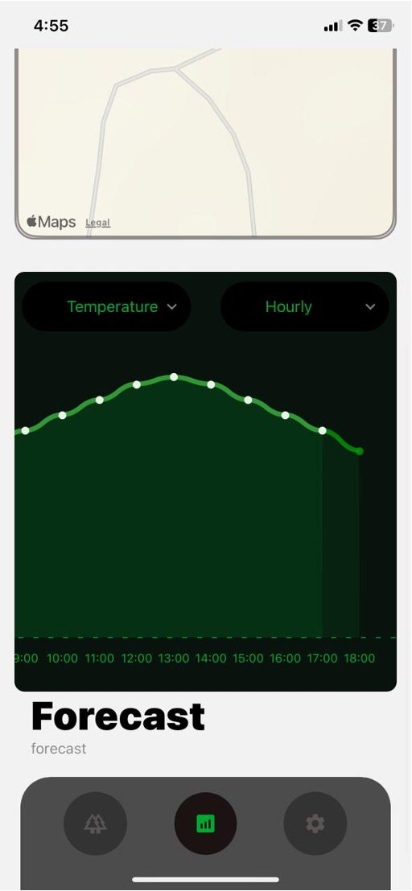
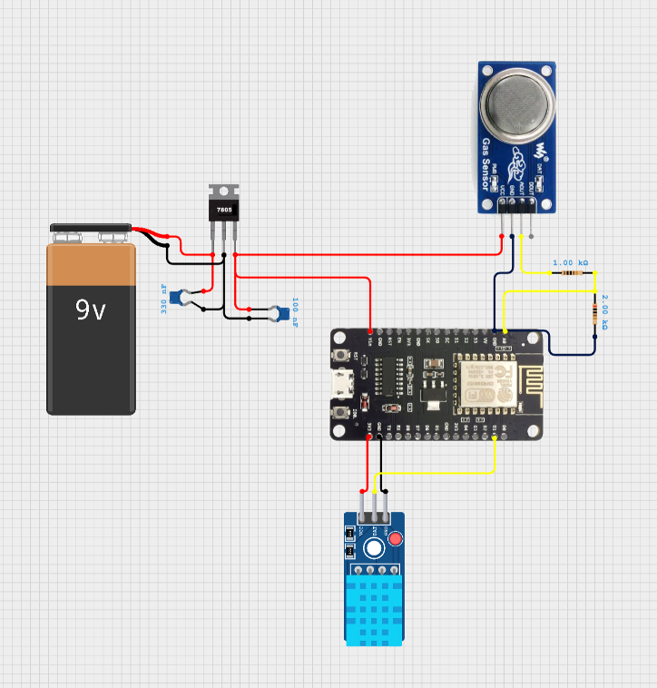
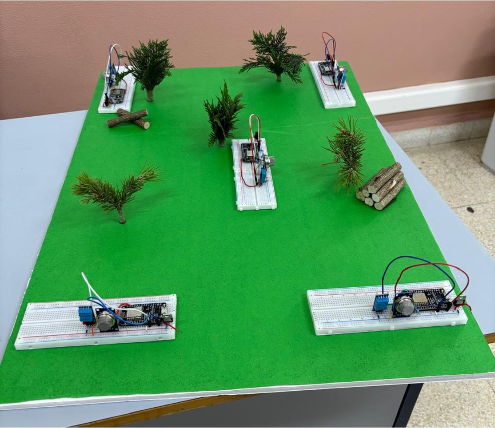

 
<br><br> 

 


- [Project Philosophy](#project-description)
  - [User Types](#user-types)
- [Prototyping](#prototyping)
- [Tech Stack](#tech-stack)
  - [Frontend](#Frontend)
  - [Backend](#Backend)
- [Machine Learning](#Machine-Learning)
  - [Prediction Model](#prediction-model)
  - [Detection Model](#detection-model)
- [Wireless Sensor Network](#wsn)
- [Demo](#Demo)
- [Performance](#Performance)
- [How to Run](#how-to-run)
  - [Prerequisites](#prerequisites)
  - [Installation](#installation)


<br><br>  

<!-- Project Description -->
<a name="project-description"></a>
 
> The aim of the EcoTech project is to develop a comprehensive application that harnesses various technologies to help prevent and alert forest guards about potential wildfire outbreaks. 
<br>


EcoTech's primary goal is to enhance forest safety by collecting vital data such as temperature, humidity, and other factors that can indicate a wildfire. This data is gathered through sensors connected to an Arduino and sent to an AI system that predicts potential fire outbreaks. If a threat is detected, the app sends real-time notifications to nearby firefighting stations and forest guards, enabling prompt and efficient response. The user base for this application includes firefighters, forest guards, and environmentally-conscious individuals committed to safeguarding forests and wildlife. 

In addition to its critical wildfire prevention functionality, EcoTech offers a unique feature that promotes community engagement in reforestation efforts. Users can view a map displaying the locations of forest sensors. 

Potential challenges for EcoTech include ensuring accurate and timely data collection and analysis, securing funding for sensor installation and maintenance, and fostering user engagement for the tree-planting feature. 

<br>

### User Types 

1. Admin 
2. General Users (Environmentally-conscious individuals)


<br>

### Features of the App 

As an Admin: 

- Create and maintain Arduino connection and configuration. 
- Receive real-time notifications of potential wildfire outbreaks for early prevention.   
- Monitor live data from various forest sensors to understand the current forest conditions. 
- Receive information about the fire risk in particular areas. 

As a General User, I want to: 

- View the locations of forest sensors to understand where monitoring is taking place. 
- Receive real-time notifications of potential wildfire outbreaks for early prevention. 
- Receive information about the fire risk in particular areas. 

<br><br> 

 
<a name="prototyping"></a>

> We designed EcoTech using wireframes and mockups using Figma, iterating on the design to ensure easy navigation and a seamless user experience.
<br>


| Login                                                       | Sign up-1                                                     | Sign up-2                                                     | Sign up-3                                                    | Sign up-4                                                     |
| ----------------------------------------------------------- | ------------------------------------------------------------- | ------------------------------------------------------------- | ------------------------------------------------------------ | ------------------------------------------------------------- |
|           |          |          |         |          |
| Map                                                         | Weather Widgets                                              | Statistics                                                    | Statistics 2                                                 | Settings                                                     |
|              |            |         |       |          |
| Profile                                                     |                                                               |                                                               |                                                              |                                                               |
|          |                                                               |                                                               |                                                              |                                                               |


<br><br> 

<a name="tech-stack" ></a>

> The application utilizes React Native (Expo) for the mobile app, Node.js with Express for the backend, MongoDB Atlas for database storage, AWS server for cloud infrastructure, Esp8266 for sensor data collection, different Machine Learning Models for predictive and detection analytics, and Firebase for real-time notifications. 
<br>

EcoTech is built using the following technologies: 

## Frontend (Mobile App)
<a name="Frontend" ></a>
- **React Native (Expo):** Used for cross-platform mobile app development.
- **Expo Packages:** Various Expo packages for accessing device features and UI components.
- **React Navigation:** Handles navigation within the app.
- **Redux:** Manages app data and state effectively.
- **Expo Notifications:** Handles push notifications.
- **Axios:** Enables network requests to the backend.

<br>

## Backend (Server)
<a name="Backend" ></a>
- **Node.js with Express:** Powers the backend server for API requests and logic.
- **MongoDB Atlas:** Cloud-based database service for data storage.
- **AWS (Amazon Web Services):** Cloud infrastructure for hosting the server and application.
- **Arduino:** Utilized for sensor data collection in the field.
- **child_process:** Enables integration of Python machine learning models into a JavaScript/Node.js environment by spawning Python scripts as subprocesses.
- **Native Notify:** Used for real-time notifications.
- **Express Rate Limit:** Middleware for rate limiting API requests.
- **Joi:** Data validation library.
- **Jsonwebtoken:** Manages JSON Web Tokens (JWT) for authentication.
- **Mailgen:** Generates email content.
- **Mongoose:** Object Data Modeling (ODM) library for MongoDB.
- **Nodemailer:** Handles email sending.

EcoTech utilizes these technologies to provide a seamless and comprehensive wildfire prevention and community engagement experience. 

<br><br> 


<a name="Machine-Learning"></a>


## Prediction Model
<a name="prediction-model"></a>
> Machine Learning Model for Wildfire Prediction (Random Forest)
<br>

The Random Forest Regressor algorithm was chosen for its effectiveness in handling nonlinear relationships, robustness against overfitting, and ability to perform well with small datasets. The model uses historical sensor data, including temperature and humidity, to predict future environmental conditions. After data collection and preprocessing, multiple machine learning algorithms were tested, including Random Forest, Linear Regression, and K-Nearest Neighbors (KNN). The Random Forest model outperformed the others with the lowest Mean Squared Error (MSE) and highest R² score, demonstrating its superior generalization ability and resistance to overfitting. The final model was trained and deployed to generate real-time predictions for temperature and humidity one hour and two hours ahead.

Before prediction:
```json
{
  "forestId": "6802aacfa0c00a2f92680184",
  "temperature": [
    {"value": 27,"hour": 17,"day": 6,"month": 5,"source": "real"}
  ],
  "humidity": [
    {"value": 55,"hour": 17,"day": 6,"month": 5,"source": "real"}
  ]
}
```
After prediction:
```json
{
    "temperature": [
        {"value": 27,"hour": 17,"day": 6,"month": 5,"source": "real"},
        {"value": 24.31,"hour": 18,"day": 6,"month": 5,"source": "predicted"}
    ],
    "humidity": [
        {"value": 55,"hour": 17,"day": 6,"month": 5,"source": "real"},
        {"value": 57.71,"hour": 18,"day": 6,"month": 5,"source": "predicted"}
    ]
}

```
## Detection Model
<a name="detection-model"></a>
> Machine Learning Model for Wildfire Detection (SVM)
<br>

The Support Vector Machine (SVM) classifier was selected for its strong performance in binary classification tasks, robustness to high-dimensional feature spaces, and effectiveness in handling both linear and nonlinear data patterns. The model uses real-time environmental sensor data, including temperature, humidity, and smoke concentration, to detect potential fire conditions. Each sensor reading is labeled based on predefined thresholds, and the model is trained on these labeled datasets. To enhance reliability, the system employs a majority voting mechanism across three independent SVM classifiers (temperature, humidity, and smoke). A fire is declared only if at least two out of the three classifiers indicate fire conditions, reducing the risk of false positives and negatives.

Input data:
```json
{
    "forestId": "6802aacfa0c00a2f92680014",
    "nodes": [
        {
            "macAddress": "BE:DD:C2:79:BE:38",
            "connected": True,
            "temperature": 41,
            "humidity": 19,
            "smoke": 2
        },
        {
            "macAddress": "BC:E6:2B:C7:A5:95",
            "connected": True,
            "temperature": 34.8,
            "humidity": 44.5,
            "smoke": 0.5
        },
        {
            "macAddress": "CA:2B:96:2C:12:F9",
            "connected": True,
            "temperature": 35.2,
            "humidity": 45.3,
            "smoke": 0.42
        }
    ]
}
```

The detection model processes the input data and determines if a fire is detected at each node

```json
{
  "message": "Node data updated successfully",
  "forestFireAlarm": ✅ True,
  "wsn": {
    "BE:DD:C2:79:BE:38": {
      "updated": ✅ True,
      "fireDetected": ✅ True
    },
    "BC:E6:2B:C7:A5:95": {
      "updated": ✅ True,
      "fireDetected": ❌ False
    },
    "CA:2B:96:2C:12:F9": {
      "updated": ✅ True,
      "fireDetected": ❌ False
    }
  }
}
```
<br><br>


<a name="wsn"></a>

>A wireless sensor network (WSN) is a system of spatially distributed autonomous devices that monitor physical or environmental conditions. In this project, it's used for environmental monitoring applications, collecting data such as temperature, humidity, and air quality.
<br>

## Node Distribution and Network Topology

The wireless sensor network (WSN) in this project employs a **star topology**. At the center of this topology is a **base station** which serves as the coordinator and data aggregator. Surrounding the base station are multiple **sensor nodes** distributed across the monitoring area. Each sensor node is responsible for collecting environmental data from its immediate vicinity and transmitting this data back to the base station.

- **Base Station**: Acts as the central hub of the network. It is responsible for coordinating communication, data aggregation, and interaction with external systems such as backend servers.
- **Sensor Nodes**: Deployed across the monitoring area to collect environmental data. Each sensor node is equipped with sensors such as the DHT11 for temperature and humidity, and the MQ-135 for air quality.

## Node Types and Their Roles

There are two primary types of nodes in this WSN system:

### Base Station Node (BS)

- **Role**: The base station serves as the central point for data collection and network coordination. It handles tasks such as time synchronization using NTP, scanning for and adding sensor nodes to the network, maintaining a list of peer nodes, and communicating with backend servers to send aggregated data.
- **Key Functions**:
  - **Time Synchronization**: Uses an NTP client to synchronize time and maintain accurate timestamps for data collection and transmission.
  - **Node Discovery**: Scans for available sensor nodes by detecting SSIDs that start with "SN_" and adds them as peers in the ESP-NOW network.
  - **Data Aggregation**: Collects data from sensor nodes, processes it, and sends it to a backend server.
  - **Network Management**: Maintains a list of connected sensor nodes, handles registration requests, and sends confirmation messages.

### Sensor Node (SN)

- **Role**: Individual sensor nodes are deployed throughout the monitoring area to collect environmental data. They are responsible for sensing environmental parameters, registering with the base station, and periodically transmitting data.
- **Key Functions**:
  - **Data Collection**: Uses sensors like the DHT11 and MQ-135 to collect temperature, humidity, and air quality data.
  - **Registration**: Upon initialization, sensor nodes discover the base station, register themselves, and receive a unique node ID.
  - **Data Transmission**: Periodically sends collected data to the base station using the ESP-NOW protocol.
  - **Fire Detection**: Monitors sensor readings to detect potential fire conditions and sends fire alarm messages if thresholds are exceeded.

## Hardware Configuration

### ESP8266
- **Type**: Low-cost, low-power system-on-chip with integrated Wi-Fi capabilities.
- **Processor**: 32-bit Tensilica L106 microprocessor operating at 80 MHz (or optionally overclocked to 160 MHz).
- **Memory**: 512 KB to 4 MB of flash memory and approximately 50 KB of SRAM.
- **Operating Modes**: Supports Station (STA), Access Point (AP), or combined AP+STA mode.
- **Power**: Operates at 3.3V logic levels.
- **Role in Project**: Serves both as a base station and as individual sensor nodes.

### DHT11
- **Type**: Digital temperature and humidity sensor.
- **Range**: Temperature 0°C to 50°C (±2°C accuracy), Humidity 20% to 80% RH (±5% accuracy).
- **Communication**: Uses a proprietary single-wire protocol.
- **Data Transmission**: 40 bits (16 bits humidity, 16 bits temperature, 8 bits checksum).
- **Role in Project**: Collects temperature and humidity readings.

### MQ-135
- **Type**: Air quality sensor detecting gases like ammonia, alcohol, benzene, smoke, and carbon dioxide.
- **Principle**: Uses a tin oxide (SnO₂) semiconductor whose resistance varies with gas concentration.
- **Heater**: Requires ~200–300°C for reliable operation, powered by a separate voltage.
- **Voltage Divider**: Uses a resistor divider to scale 0–5V output to 0–3.33V for ESP8266 ADC compatibility.
- **Role in Project**: Detects and measures various gases in the air.

## Communication Protocol – ESP-NOW

- **Type**: Proprietary, connectionless wireless communication protocol developed by Espressif.
- **Operation**: Uses MAC-layer broadcast or unicast messages without Wi-Fi connection or IP addressing.
- **Features**:
  - Supports unicast and broadcast communication.
  - Maximum payload size of 250 bytes per packet.
  - Secure communication using AES encryption.
  - Suitable for low-latency, energy-efficient communication in mesh or peer-to-peer networks.

User Defined Class:
- **NetworkPayload**: A packed C++ struct managing data communication between nodes over ESP-NOW, including header fields for protocol type, timestamp, and MAC addresses, and a union for different payload types.

## Power Consumption

- **ESP8266**: ~67 mA in idle connected mode, 435 mA during packet transmissions, ~34 mA with Wi-Fi disabled, and ~0.2 mA in deep sleep mode.
- **MQ-135**: ~150–180 mA at 5V for the internal heater.
- **DHT11**: ~2.5 mA peak during measurements.
- **Regulator**: L7805C linear regulator with ~8 mA quiescent current.
- **Battery**: 9V PP3 battery with ~550 mAh capacity, providing ~2.1 hours of continuous operation. Deep sleep and duty cycling can extend runtime to over 50 hours.

| Single Node Circuit Diagram |
| --- |
|  |


<br><br> 


<a name="Demo" ></a>

> Based on the wireframes and mockups, we implemented the EcoTech app with the following features: 
<br>

### Screens 

| Register | Map | Statistic | Profile | Push Notification |
| --- | --- | --- | --- | --- |
|  |  |  |  |  |
| WSN Indication |
|  |

### Admin Screen

| Create Forest |
| --- |
|  |


### Wireless Sensor Network

| Circuit Design |
| --- |
|  |


<br><br> 


<a name="Performance" ></a>
 
> The following tests were conducted in Postman to assess the functionality of my application's primary APIs
<br>

URL: http://63.35.223.98:8080/user/get_forests

```sh 
PASS: Response time is within acceptable range //199 ms
PASS: Response content type is JSON
PASS: Response schema is valid
PASS: Response has the required field - message
PASS: Response content type is JSON

```

<br>
URL: http://63.35.223.98:8080/user/get_forest_data

```sh 
PASS: Response time is within acceptable range //258 ms
PASS: Response content type is JSON
PASS: Response schema is valid
PASS: Response has the required field - message
PASS: Response content type is JSON
```
<br>
URL: http://63.35.223.98:8080/forest/update-forest-data

```sh 
FAIL: Response time is within acceptable range | AssertionError: Response time should be below 1000ms: expected 6938 to be below 1000
PASS: Response content type is JSON
PASS: Response schema is valid
PASS: Response has the required field - message
PASS: Response content type is JSON
```
<span style="font-size: 12px;">Note: This API isn't for regular user interactions; it uses unique logic, including OpenAI integration and array searching, for forest updates.</span>


<br><br> 


<a name="how-to-run" ></a>
 
> To set up EcoTech locally, follow these steps: 
<br>

### Prerequisites 
<br>
Ensure you have the following software and dependencies installed: 

1. Node.js and npm (Node Package Manager). You can install them from [nodejs.org](https://nodejs.org/).
2. Make sure you have Python installed from [python.org](https://www.python.org/downloads/). 

3. Expo CLI for React Native. You can install it globally using the command: 

```sh 
npm install -g expo-cli 
```

4. Clone the GitHub repository: 

```sh 
git clone https://github.com/Rayan-Emad1/EcoTech  
```

<br>

### Installation:

<br>

#### Frontend (Mobile App) 


1. Navigate to the `client` directory: 

   ```bash  
   cd EcoTech/client 
   ``` 
2. Install dependencies:  

   ```bash  
     npm install 
   ``` 
3. Start development server: 

   ```bash  
   npx expo start  
   ``` 
<br>

#### Backend (Server) 

1. Navigate to the `server` directory: 

   ```bash 
   cd EcoTech/server 
   ``` 

2. Install dependencies: 

   ```bash   
   npm install 
   ```  

3. Create a `.env` file with your credentials

   ```bash  
   cp env.example .env
   ``` 
  
4. Start the server: 

   ```bash 
   npm run start 
   ```

   <br>

#### Machine Learning

1. Navigate to the `Machine_Learning` directory: 

   ```bash 
   cd EcoTech/server/Machine_Learning 
   ``` 

2. Install dependencies: 

   ```bash   
   pip install -r requirements.txt
   ```  
  

Now you can run the app locally and test out its features. Make sure to run both frontend and backend concurrently. 